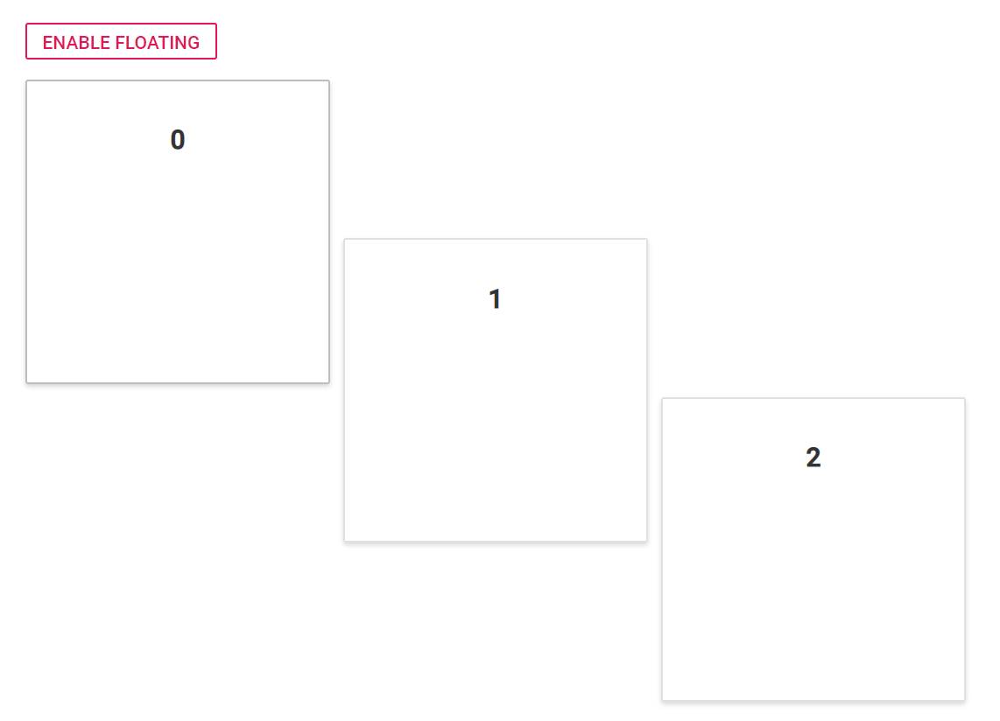

# Floating panels

The floating functionality of the component allows you to effectively use the entire layout for the panel's placement. If the floating functionality is enabled, the panels within the layout get floated upwards automatically to occupy the empty cells available in previous rows. This functionality can be enabled or disabled using the [`allowFloating`](https://help.syncfusion.com/cr/cref_files/aspnetcore-js2/Syncfusion.EJ2~Syncfusion.EJ2.Layouts.DashboardLayout~AllowFloating.html) property of the component.

The following sample demonstrates how to enable or disable the floating of panels in the DashboardLayout component using [`allowFloating`](https://help.syncfusion.com/cr/cref_files/aspnetcore-js2/Syncfusion.EJ2~Syncfusion.EJ2.Layouts.DashboardLayout~AllowFloating.html) property.





When [`allowFloating`](https://help.syncfusion.com/cr/cref_files/aspnetcore-js2/Syncfusion.EJ2~Syncfusion.EJ2.Layouts.DashboardLayout~AllowFloating.html) value set as false, the output is like the below.

When [`allowFloating`](https://help.syncfusion.com/cr/cref_files/aspnetcore-js2/Syncfusion.EJ2~Syncfusion.EJ2.Layouts.DashboardLayout~AllowFloating.html) value set as true, the output is like the below.

> You can refer to our [ASP.NET Core Dashboard Layout](https://www.syncfusion.com/aspnet-core-ui-controls/dashboard-layout) feature tour page for its groundbreaking feature representations. You can also explore our [ASP.NET Core Dashboard Layout example](https://ej2.syncfusion.com/aspnetcore/DashboardLayout/DefaultFunctionalities#/material) to knows how to present and manipulate data.