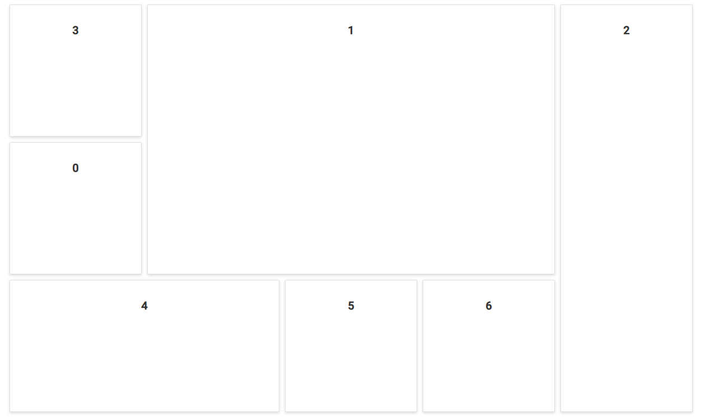

# Moving of panels programatically

Other than drag and drop, it is possible to move the panels in Dashboard Layout programatically. This can be achieved using `movePanel` method. The method is invoked as follows,

```js
movePanel(id, row, col)

```

Where,
* id - ID of the panel which needs to be moved.
* row - New row position for moving the panel.
* col - New column position for moving the panel.

Each time a panel's position is changed(Programatically or through UI interaction), the Dashboard Layout's [`change`](https://help.syncfusion.com/cr/cref_files/aspnetcore-js2/Syncfusion.EJ2~Syncfusion.EJ2.Layouts.DashboardLayout~Change.html) event will be triggered.

The following sample demonstrates moving a panel programatically to a new position in the Dashboard Layout's [created](https://help.syncfusion.com/cr/cref_files/aspnetcore-js2/Syncfusion.EJ2~Syncfusion.EJ2.Layouts.DashboardLayout~Created.html) event.





Output be like the below.



> You can refer to our [ASP.NET Core Dashboard Layout](https://www.syncfusion.com/aspnet-core-ui-controls/dashboard-layout) feature tour page for its groundbreaking feature representations. You can also explore our [ASP.NET Core Dashboard Layout example](https://ej2.syncfusion.com/aspnetcore/DashboardLayout/DefaultFunctionalities#/material) to knows how to present and manipulate data.