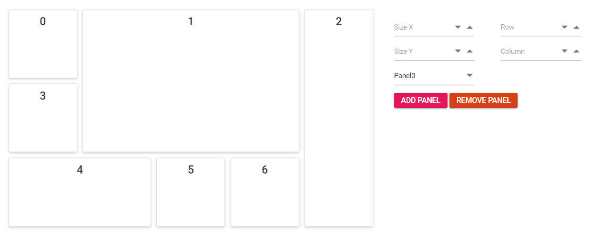

# Adding and removing panels dynamically

In real-time cases, the data being presented within the dashboard should be updated frequently which includes adding or removing the data dynamically within the dashboard. This can be easily achieved by using the `addPanel` and `removePanel` public methods of the component.

## Add or remove panels dynamically

Panels can be added dynamically by using the `addPanel` public method by passing the panel property as parameter. Also, they can be removed dynamically by using the `removePanel` public method by passing the panel id value as a parameter.

It is also possible to remove all the panels in a Dashboard Layout by calling `removeAll` method.

```js
dashboard.removeAll();

```

The following sample demonstrates how to add and remove the panels dynamically in the dashboard layout component. Here, panels can be added in any desired position of required size by selecting them in the numeric boxes and clicking add button and remove them by selecting the ID of the panel.





Output be like the below.



> You can refer to our [ASP.NET Core Dashboard Layout](https://www.syncfusion.com/aspnet-core-ui-controls/dashboard-layout) feature tour page for its groundbreaking feature representations. You can also explore our [ASP.NET Core Dashboard Layout example](https://ej2.syncfusion.com/aspnetcore/DashboardLayout/DefaultFunctionalities#/material) to knows how to present and manipulate data.