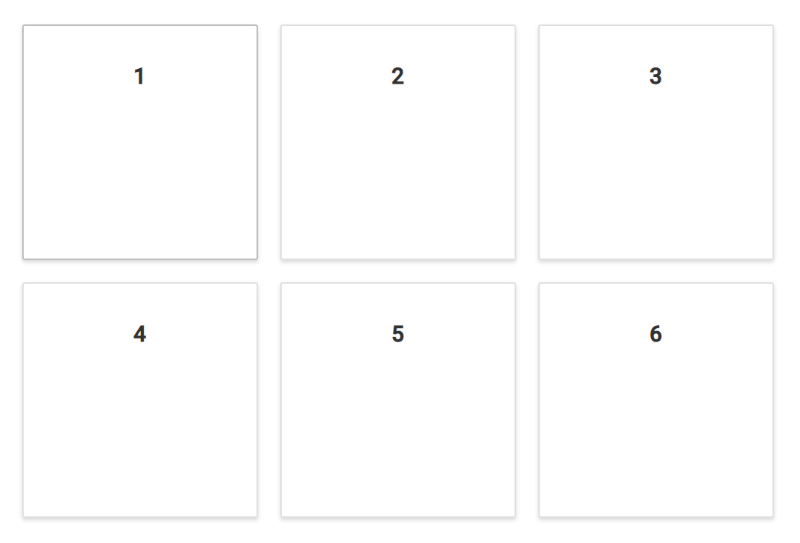
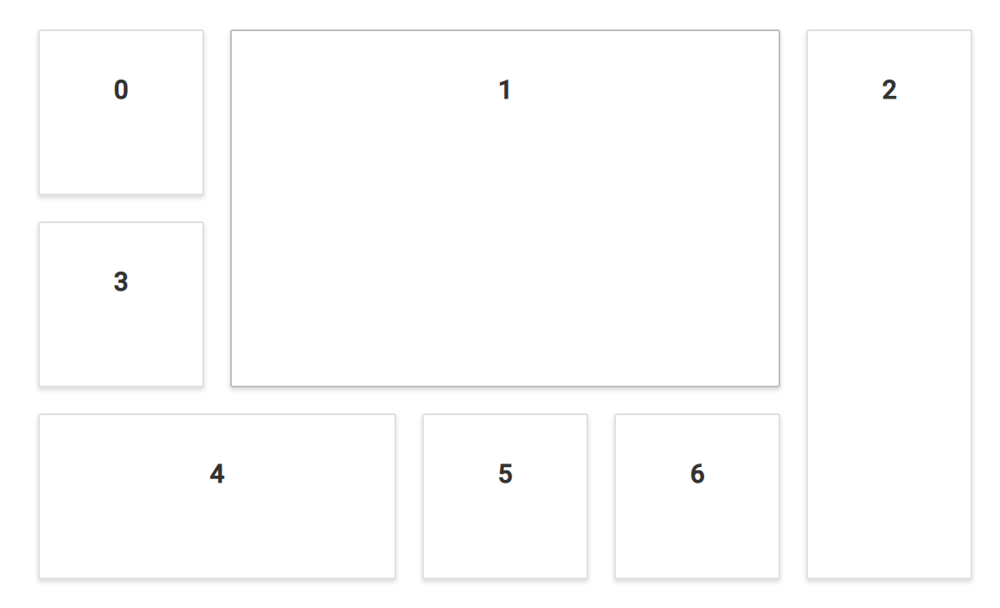

# Panels

Panels are the basic building blocks of the dashboard layout component. They act as a container for the data to be visualized or presented. These panels can be positioned or resized for effective presentation of the data.

The below table represents all the available panel properties and the corresponding functionalities

| **PanelObject** | **Description** |
| --- | --- |
| <kbd>id</kbd> | Specifies the id value of the panel. |
| <kbd>row</kbd> | Specifies the row value in which the panel to be placed. |
| <kbd>col</kbd> | Specifies the column value in which the panel to be placed. |
| <kbd>sizeX</kbd> | Specifies the width of the panel in cells count. |
| <kbd>sizeY</kbd> | Specifies the height of the panel in cells count. |
| <kbd>minSizeX</kbd> |Specifies the minimum width of the panel in cells count. |
| <kbd>minSizeY</kbd> | Specifies the minimum height of the panel in cells count. |
| <kbd>maxSizeX</kbd> | Specifies the maximum width of the panel in cells count. |
| <kbd>maxSizeY</kbd> | Specifies the maximum height of the panel in cells count. |
| <kbd>header</kbd> | Specifies the header template of the panel. |
| <kbd>content</kbd> | Specifies the content template of the panel. |
| <kbd>cssClass</kbd> | Specifies the CSS class name that can be appended with each panel element.|

## Positioning of panels

The panels within the layout can be easily positioned or ordered using the [`row`](https://help.syncfusion.com/cr/cref_files/aspnetcore-js2/Syncfusion.EJ2~Syncfusion.EJ2.Layouts.DashboardLayoutPanel~Row.html) and [`col`](https://help.syncfusion.com/cr/cref_files/aspnetcore-js2/Syncfusion.EJ2~Syncfusion.EJ2.Layouts.DashboardLayoutPanel~Col.html) properties of the panels. Positioning of panels will be beneficial to represent the data in any desired order.

The following sample demonstrates the positioning of panels within the dashboard layout using the row and column properties of the panels.





Output be like the below.

## Sizing of panels

A panel's size can be varied easily by defining the [`sizeX`](https://help.syncfusion.com/cr/cref_files/aspnetcore-js2/Syncfusion.EJ2~Syncfusion.EJ2.Layouts.DashboardLayoutPanel~SizeX.html) and [`sizeY`](https://help.syncfusion.com/cr/cref_files/aspnetcore-js2/Syncfusion.EJ2~Syncfusion.EJ2.Layouts.DashboardLayoutPanel~SizeY.html) properties. The [`sizeX`](https://help.syncfusion.com/cr/cref_files/aspnetcore-js2/Syncfusion.EJ2~Syncfusion.EJ2.Layouts.DashboardLayoutPanel~SizeX.html) property defines the width and the [`sizeY`](https://help.syncfusion.com/cr/cref_files/aspnetcore-js2/Syncfusion.EJ2~Syncfusion.EJ2.Layouts.DashboardLayoutPanel~SizeY.html) property defines height of a panel in cells count. These properties are helpful in designing a dashboard, where the content of each panel may vary in size.

The following sample demonstrates the sizing of panels within the dashboard layout using the sizeX and sizeY properties of the panels.





Output be like the below.

> You can refer to our [ASP.NET Core Dashboard Layout](https://www.syncfusion.com/aspnet-core-ui-controls/dashboard-layout) feature tour page for its groundbreaking feature representations. You can also explore our [ASP.NET Core Dashboard Layout example](https://ej2.syncfusion.com/aspnetcore/DashboardLayout/DefaultFunctionalities#/material) to knows how to present and manipulate data.