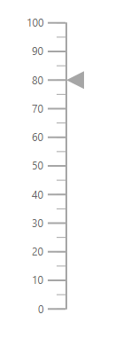
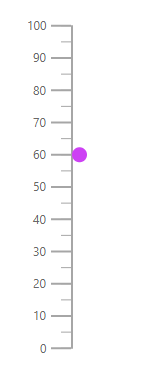
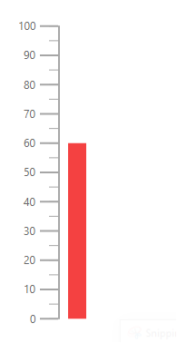

# Pointers in ASP.NET MVC Linear Gauge

Pointers are used to indicate values on an axis. The value of the pointer can be modified using the [`Value`](https://help.syncfusion.com/cr/aspnetmvc-js2/Syncfusion.EJ2.LinearGauge.LinearGaugePointer.html#Syncfusion_EJ2_LinearGauge_LinearGaugePointer_Value) property in [`LinearGaugePointer`](https://help.syncfusion.com/cr/aspnetmvc-js2/Syncfusion.EJ2.LinearGauge.LinearGaugePointer.html).





## Types of pointer

The Linear Gauge supports the following types of pointers:

* Bar
* Marker

The type of pointer can be modified by using the [`Type`](https://help.syncfusion.com/cr/aspnetmvc-js2/Syncfusion.EJ2.LinearGauge.LinearGaugePointer.html#Syncfusion_EJ2_LinearGauge_LinearGaugePointer_Type) property in [`LinearGaugePointer`](https://help.syncfusion.com/cr/aspnetmvc-js2/Syncfusion.EJ2.LinearGauge.LinearGaugePointer.html).

### Marker pointer

A marker pointer is a shape that can be used to mark the pointer value in the Linear Gauge.

<b>Types of marker shapes</b>

By default, the marker shape for the pointer is **InvertedTriangle**. To change the shape of the pointer, use the [`MarkerType`](https://help.syncfusion.com/cr/aspnetmvc-js2/Syncfusion.EJ2.LinearGauge.LinearGaugePointer.html#Syncfusion_EJ2_LinearGauge_LinearGaugePointer_MarkerType) property in [`LinearGaugePointer`](https://help.syncfusion.com/cr/aspnetmvc-js2/Syncfusion.EJ2.LinearGauge.LinearGaugePointer.html). The following marker types are available in Linear Gauge.

* Circle
* Rectangle
* Triangle
* InvertedTriangle
* Diamond
* Image

An image can be rendered instead of rendering a shape as a pointer. It can be achieved by setting the [`MarkerType`](https://help.syncfusion.com/cr/aspnetmvc-js2/Syncfusion.EJ2.LinearGauge.LinearGaugePointer.html#Syncfusion_EJ2_LinearGauge_LinearGaugePointer_MarkerType) property to **Image** and setting the source URL of image to [`ImageUrl`](https://help.syncfusion.com/cr/aspnetmvc-js2/Syncfusion.EJ2.LinearGauge.LinearGaugePointer.html#Syncfusion_EJ2_LinearGauge_LinearGaugePointer_ImageUrl) property in [`LinearGaugePointer`](https://help.syncfusion.com/cr/aspnetmvc-js2/Syncfusion.EJ2.LinearGauge.LinearGaugePointer.html).





<!-- markdownlint-disable MD036 -->

**Marker pointer customization**

The marker pointer can be customized using the following properties and class.

* [`Height`](https://help.syncfusion.com/cr/aspnetmvc-js2/Syncfusion.EJ2.LinearGauge.LinearGaugePointer.html#Syncfusion_EJ2_LinearGauge_LinearGaugePointer_Height) - To set the height of the pointer.
* [`Position`](https://help.syncfusion.com/cr/aspnetmvc-js2/Syncfusion.EJ2.LinearGauge.LinearGaugePointer.html#Syncfusion_EJ2_LinearGauge_LinearGaugePointer_Position) -  The position of the pointer can be changed by setting the value as **Inside**, **Outside**, **Cross**, or **Auto**.
* [`Width`](https://help.syncfusion.com/cr/aspnetmvc-js2/Syncfusion.EJ2.LinearGauge.LinearGaugePointer.html#Syncfusion_EJ2_LinearGauge_LinearGaugePointer_Width) - To set the width of the pointer.
* [`Color`](https://help.syncfusion.com/cr/aspnetmvc-js2/Syncfusion.EJ2.LinearGauge.LinearGaugePointer.html#Syncfusion_EJ2_LinearGauge_LinearGaugePointer_Color) - To set the color of the pointer.
* [`Placement`](https://help.syncfusion.com/cr/aspnetmvc-js2/Syncfusion.EJ2.LinearGauge.LinearGaugePointer.html#Syncfusion_EJ2_LinearGauge_LinearGaugePointer_Placement) - To place the pointer in the specified position. By default, the pointer is placed **Far** from the axis. To change the placement, set the [`Placement`](https://help.syncfusion.com/cr/aspnetcore-js2/Syncfusion.EJ2.LinearGauge.LinearGaugePointer.html#Syncfusion_EJ2_LinearGauge_LinearGaugePointer_Placement) property as **Near**, **Center**, or **None**.
* [`Offset`](https://help.syncfusion.com/cr/aspnetmvc-js2/Syncfusion.EJ2.LinearGauge.LinearGaugePointer.html#Syncfusion_EJ2_LinearGauge_LinearGaugePointer_Offset) - To place the pointer with specified distance from the axis.
* [`Opacity`](https://help.syncfusion.com/cr/aspnetmvc-js2/Syncfusion.EJ2.LinearGauge.LinearGaugePointer.html#Syncfusion_EJ2_LinearGauge_LinearGaugePointer_Opacity) - To set the opacity of the pointer.
* [`AnimationDuration`](https://help.syncfusion.com/cr/aspnetmvc-js2/Syncfusion.EJ2.LinearGauge.LinearGaugePointer.html#Syncfusion_EJ2_LinearGauge_LinearGaugePointer_AnimationDuration) - To specify the duration of the animation in pointer.
* [`Border`](https://help.syncfusion.com/cr/aspnetmvc-js2/Syncfusion.EJ2.LinearGauge.LinearGaugePointer.html#Syncfusion_EJ2_LinearGauge_LinearGaugePointer_Border) - To set the color and width for the border of the pointer.





### Bar pointer

The bar pointer is used to track the axis value. The bar pointer starts from the beginning of the gauge and ends at the pointer value. To enable bar pointer set the [`Type`](https://help.syncfusion.com/cr/aspnetmvc-js2/Syncfusion.EJ2.LinearGauge.LinearGaugePointer.html#Syncfusion_EJ2_LinearGauge_LinearGaugePointer_Type) property in [`LinearGaugePointer`](https://help.syncfusion.com/cr/aspnetmvc-js2/Syncfusion.EJ2.LinearGauge.LinearGaugePointer.html) as **Bar**.





<!-- markdownlint-disable MD036 -->

**Bar pointer customization**

The bar pointer can be customized using following properties and class.

* [`Width`](https://help.syncfusion.com/cr/aspnetmvc-js2/Syncfusion.EJ2.LinearGauge.LinearGaugePointer.html#Syncfusion_EJ2_LinearGauge_LinearGaugePointer_Width) - To set the thickness of the bar pointer.
* [`Color`](https://help.syncfusion.com/cr/aspnetmvc-js2/Syncfusion.EJ2.LinearGauge.LinearGaugePointer.html#Syncfusion_EJ2_LinearGauge_LinearGaugePointer_Color) - To set the color of the bar pointer.
* [`Offset`](https://help.syncfusion.com/cr/aspnetmvc-js2/Syncfusion.EJ2.LinearGauge.LinearGaugePointer.html#Syncfusion_EJ2_LinearGauge_LinearGaugePointer_Offset) - To place the bar pointer with the specified distance from it's default position.
* [`Opacity`](https://help.syncfusion.com/cr/aspnetmvc-js2/Syncfusion.EJ2.LinearGauge.LinearGaugePointer.html#Syncfusion_EJ2_LinearGauge_LinearGaugePointer_Opacity) - To set the opacity of the bar pointer.
* [`RoundedCornerRadius`](https://help.syncfusion.com/cr/aspnetmvc-js2/Syncfusion.EJ2.LinearGauge.LinearGaugePointer.html#Syncfusion_EJ2_LinearGauge_LinearGaugePointer_RoundedCornerRadius) - To set the corner radius of the bar pointer.
* [`Border`](https://help.syncfusion.com/cr/aspnetmvc-js2/Syncfusion.EJ2.LinearGauge.LinearGaugePointer.html#Syncfusion_EJ2_LinearGauge_LinearGaugePointer_Border) - To set the color and width for the border of the pointer.
* [`AnimationDuration`](https://help.syncfusion.com/cr/aspnetmvc-js2/Syncfusion.EJ2.LinearGauge.LinearGaugePointer.html#Syncfusion_EJ2_LinearGauge_LinearGaugePointer_AnimationDuration) - To set the duration of the animation in bar pointer.

>The Placement property is not applicable for the bar pointer.





## Multiple pointers

Multiple pointers can be added to the Linear Gauge by adding multiple [`LinearGaugePointer`](https://help.syncfusion.com/cr/aspnetmvc-js2/Syncfusion.EJ2.LinearGauge.LinearGaugePointer.html) in the [`LinearGaugePointers`](https://help.syncfusion.com/cr/aspnetmvc-js2/Syncfusion.EJ2.LinearGauge.LinearGaugePointers.html) and customization for the pointers can be done with [`LinearGaugePointer`](https://help.syncfusion.com/cr/aspnetmvc-js2/Syncfusion.EJ2.LinearGauge.LinearGaugePointer.html).





## Pointer animation

Pointer is animated on loading the gauge. This can be handled using the [`AnimationDuration`](https://help.syncfusion.com/cr/aspnetmvc-js2/Syncfusion.EJ2.LinearGauge.LinearGaugePointer.html#Syncfusion_EJ2_LinearGauge_LinearGaugePointer_AnimationDuration) property. The duration of the animation can be specified in milliseconds.





## Gradient Color

Gradient support allows the addition of multiple colors in the pointers of the Linear Gauge. The following gradient types are supported in the Linear Gauge.

* Linear Gradient
* Radial Gradient

### Linear Gradient

Using linear gradient, colors will be applied in a linear progression. The start value of the linear gradient can be set using the [`StartValue`](https://help.syncfusion.com/cr/aspnetmvc-js2/Syncfusion.EJ2.LinearGauge.LinearGaugeLinearGradient.html#Syncfusion_EJ2_LinearGauge_LinearGaugeLinearGradient_StartValue) property. The end value of the linear gradient will be set using the [`EndValue`](https://help.syncfusion.com/cr/aspnetmvc-js2/Syncfusion.EJ2.LinearGauge.LinearGaugeLinearGradient.html#Syncfusion_EJ2_LinearGauge_LinearGaugeLinearGradient_EndValue) property. The color stop values such as [`Color`](https://help.syncfusion.com/cr/aspnetmvc-js2/Syncfusion.EJ2.LinearGauge.LinearGaugeColorStop.html#Syncfusion_EJ2_LinearGauge_LinearGaugeColorStop_Color), [`Opacity`](https://help.syncfusion.com/cr/aspnetmvc-js2/Syncfusion.EJ2.LinearGauge.LinearGaugeColorStop.html#Syncfusion_EJ2_LinearGauge_LinearGaugeColorStop_Opacity), and [`Offset`](https://help.syncfusion.com/cr/aspnetmvc-js2/Syncfusion.EJ2.LinearGauge.LinearGaugeColorStop.html#Syncfusion_EJ2_LinearGauge_LinearGaugeColorStop_Offset) are set using [`ColorStop`](https://help.syncfusion.com/cr/aspnetmvc-js2/Syncfusion.EJ2.LinearGauge.LinearGaugeLinearGradient.html#Syncfusion_EJ2_LinearGauge_LinearGaugeLinearGradient_ColorStop) property.





### Radial Gradient

Using radial gradient, colors will be applied in circular progression. The inner circle position of the radial gradient will be set using the [`InnerPosition`](https://help.syncfusion.com/cr/aspnetmvc-js2/Syncfusion.EJ2.LinearGauge.LinearGaugeRadialGradient.html#Syncfusion_EJ2_LinearGauge_LinearGaugeRadialGradient_InnerPosition) property. The outer circle position of the radial gradient can be set using the [`OuterPosition`](https://help.syncfusion.com/cr/aspnetmvc-js2/Syncfusion.EJ2.LinearGauge.LinearGaugeRadialGradient.html#Syncfusion_EJ2_LinearGauge_LinearGaugeRadialGradient_OuterPosition) property. The color stop values such as [`Color`](https://help.syncfusion.com/cr/aspnetmvc-js2/Syncfusion.EJ2.LinearGauge.LinearGaugeColorStop.html#Syncfusion_EJ2_LinearGauge_LinearGaugeColorStop_Color), [`Opacity`](https://help.syncfusion.com/cr/aspnetmvc-js2/Syncfusion.EJ2.LinearGauge.LinearGaugeColorStop.html#Syncfusion_EJ2_LinearGauge_LinearGaugeColorStop_Opacity), and [`Offset`](https://help.syncfusion.com/cr/aspnetmvc-js2/Syncfusion.EJ2.LinearGauge.LinearGaugeColorStop.html#Syncfusion_EJ2_LinearGauge_LinearGaugeColorStop_Offset) are set using [`ColorStop`](https://help.syncfusion.com/cr/aspnetmvc-js2/Syncfusion.EJ2.LinearGauge.LinearGaugeRadialGradient.html#Syncfusion_EJ2_LinearGauge_LinearGaugeRadialGradient_ColorStop) property.





>If we set both gradients, only the linear gradient gets rendered. If we set the [`StartValue`](https://help.syncfusion.com/cr/aspnetmvc-js2/Syncfusion.EJ2.LinearGauge.LinearGaugeLinearGradient.html#Syncfusion_EJ2_LinearGauge_LinearGaugeLinearGradient_StartValue) and [`EndValue`](https://help.syncfusion.com/cr/aspnetmvc-js2/Syncfusion.EJ2.LinearGauge.LinearGaugeLinearGradient.html#Syncfusion_EJ2_LinearGauge_LinearGaugeLinearGradient_EndValue) of the [`LinearGradient`](https://help.syncfusion.com/cr/aspnetmvc-js2/Syncfusion.EJ2.LinearGauge.LinearGaugeLinearGradient.html) as empty strings, then the radial gradient gets rendered in the pointer of the Linear Gauge.