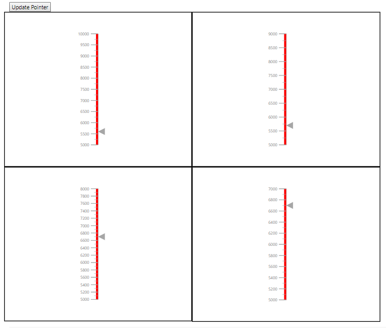

# How To

<!-- markdownlint-disable MD034 -->

<!-- markdownlint-disable MD036 -->

## Rendering linear gauges dynamically

In the linear gauge control, you can render the number of gauges dynamically and update the pointer values in ajax call.

To render the number of linear gauges dynamically, follow the given steps:

**Step 1**:

Initialize the data table collection with stock details.

```cs
    public ActionResult Index()
        {
            DataTable dt = new DataTable();
            dt.Columns.Add("Name");
            dt.Columns.Add("FullName");
            dt.Columns.Add("Stock");
            dt.Columns.Add("MaxStock");
            dt.Columns.Add("FreeStock");
            dt.Columns.Add("AvailableStock");
            dt.Columns.Add("StockCode");
            dt.Columns.Add("Status");
            dt.Rows.Add(new Object[] { "T13", "PM01 T13", 5000, 10000, 5000, 8230, "F" });
            dt.Rows.Add(new Object[] { "T14", "PM01 T14", 4000, 9000, 5000, 7230, "F" });
            dt.Rows.Add(new Object[] { "T15", "PM01 T15", 3000, 8000, 5000, 5230, "F" });
            dt.Rows.Add(new Object[] { "T16", "PM01 T16", 2000, 7000, 5000, 5230, "F" });

            List<LinearData> gauges = new List<LinearData>();

            foreach (DataRow row in dt.Rows)
                gauges.Add(CreateLinearGauge(row));

            ViewBag.GaugeData = gauges;
            return View();
        }
        LinearData CreateLinearGauge(DataRow row)
        {

            double minimum = Convert.ToDouble(row["FreeStock"]);
            double maximum = Convert.ToDouble(row["MaxStock"]);
            double value = Convert.ToDouble(row["AvailableStock"]);
            return new LinearData() { Minimum = minimum, Maximum = maximum, Value = value };
        }
```

**Step 2**:

Render the linear gauges based on the length of data collection that is from controller page.

```html
@{
            var count = 0;
            foreach (LinearData gauge in ViewBag.GaugeData)
            {

                @(Html.EJS().LinearGauge("PointerGauge" + (++count).ToString()).Border(br => br.Color("black").Width(2)).Axes(axes =>
            {
                axes.LabelStyle(ls => ls.Font(font)).Minimum(gauge.Minimum).Maximum(gauge.Maximum).Ranges(range =>
                {
                    range.Start(gauge.Minimum).End(gauge.Maximum).StartWidth(6).EndWidth(6).Color("red").Add();
                }).Pointers(pointer =>
                {
                    pointer.Value(gauge.Value).Add();
                }).Add();
            }
                ).Width("550").Render())
            }
        }
```

**Step 3**:

Create a button element to call the ajax request in the button click event. In ajax call, you can update the gauge pointer values based on the ajax data.

```html
<button id="updatePointer" onclick="updatePointer()">Update Pointer</button>

<script>
    var updatePointer = function () {
        $.ajax({
            type: "POST",
            url: '@Url.Action("GetServerData","maps")',
            async: false,
            success: function (data) {
                var gauge;
                for (var i = 0; i < data.length; i++) {
                    gauge = document.getElementById('PointerGauge' + (i+1).toString()).ej2_instances[0];
                    gauge.axes[0].pointers[0].value = data[i].value;
                    gauge.refresh();
                }
            }
        });
    }
</script>
```

```cs
public ActionResult GetServerData()
        {
            List<pointData> data1 = new List<pointData>();
            data1.Add(new pointData(5600));
            data1.Add(new pointData(5700));
            data1.Add(new pointData(6700));
            data1.Add(new pointData(6700));
            return Json(data1);
        }

 public class pointData
    {
        public pointData(double value)
        {
            this.value = value;
        }
        public double value { get; set; }
    }
```





**Sample reference**

[`linear Gauge sample`](https://github.com/SyncfusionExamples/How-to-render-linear-gauges-dynamically-in-EJ2-MVC).

**Screenshot**

**Initial Gauges**


**Update pointers on button click**

