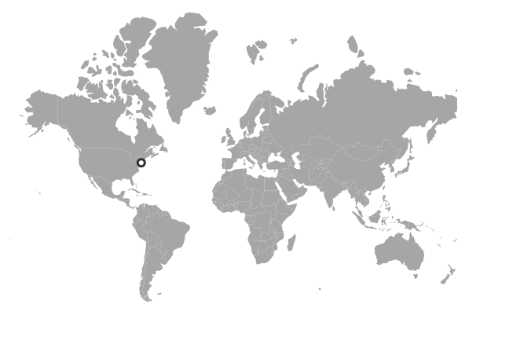
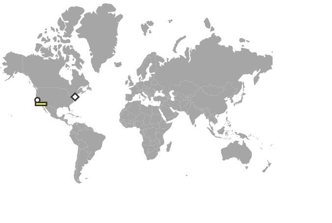

# Marker types

## Add different types of markers

Different marker objects can be added to the Maps component using the marker settings. To update different marker settings in Maps, please follow the given steps.

**Step 1**:

Initialize the Maps control with marker settings. Here, a marker has been added with specified latitude and longitude of California by using the `DataSource` property. To customize the shape of the marker using the `Shape` property and change the border color and width of the marker using the `Border` property as mentioned in the following example.





**Step 2**:

Customize the above option for n number of markers as mentioned in the following example.





