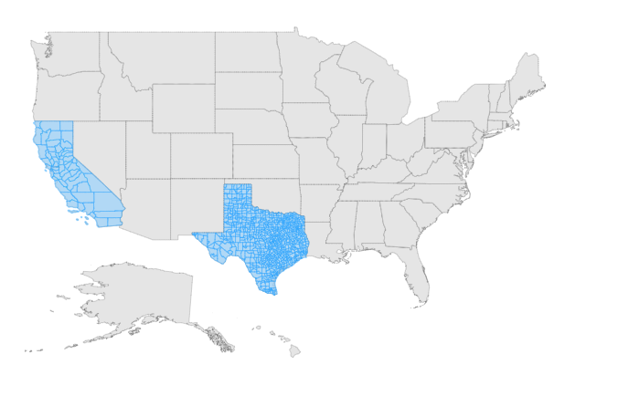

# Adding multiple layers in the Map

The multilayer support allows loading multiple shape files in a single container and enables Maps to display more information. The shape layer is the main layer of the Maps. Multiple layers can be added in a shape layer as **SubLayer** using the `Type` property.





