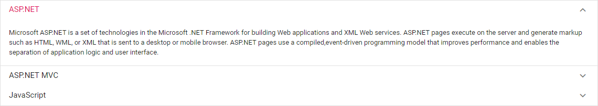

# Getting Started

 This section briefly explains about how to include a simple Accordion in your ASP.NET MVC application. You can refer [ASP.NET MVC Getting Started documentation](https://ej2.syncfusion.com/aspnetmvc/documentation/getting-started/) page for introduction part of the system requirements and configure the common specifications.

## Adding component to the Application

* Now open your view page to render Accordion component.





Output be like the below.

## Render the Accordion using content template

You can bind any data in Accordion items, by simply using the content template property in ASP.NET Accordion. Accordion is already provided with the content template support and hence we can utilize this support to load the other HTML elements or as per your requirement

In the below demo, the Accordion items are given with [chart](../../chart), [grid](../../grid), [calender](../../calendar) as their content using the content template.





Output be like the below.

You can also render accordion without using `ContentTemplate` which can be referred [here](../../accordion/how-to/set-the-nested-accordion).