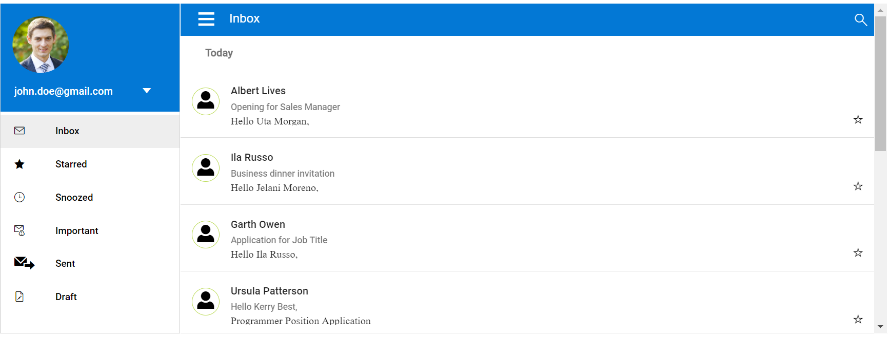

# Sidebar with fixed position

The Sidebar does not require any specific style to make it as a fixed one. By default, the Sidebar position will be in fixed state. The following example demonstrates that the Sidebar is rendered with a fixed position. The position of the Sidebar will not change when scrolling the main content area.





Output be like the below.

