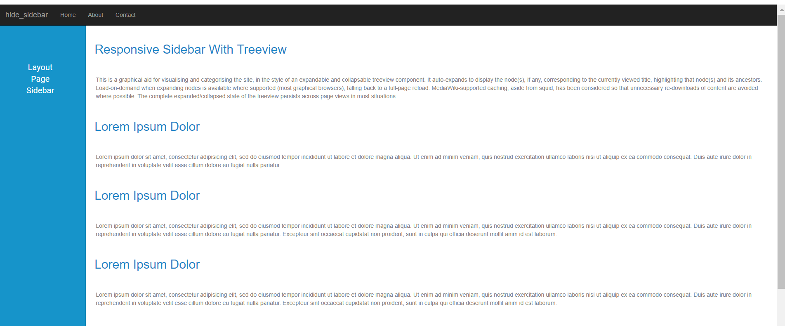
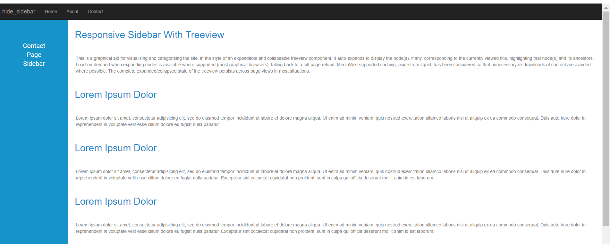

# Hide Sidebar

The following example demonstrates how to hide layout page sidebar. Initially sidebar is rendered with layout page. While navigate to another page, it hides the layout page sidebar.





Output be like the below in layout page.

Output be like the below, while navigate to other page, it hides the layout page sidebar.

