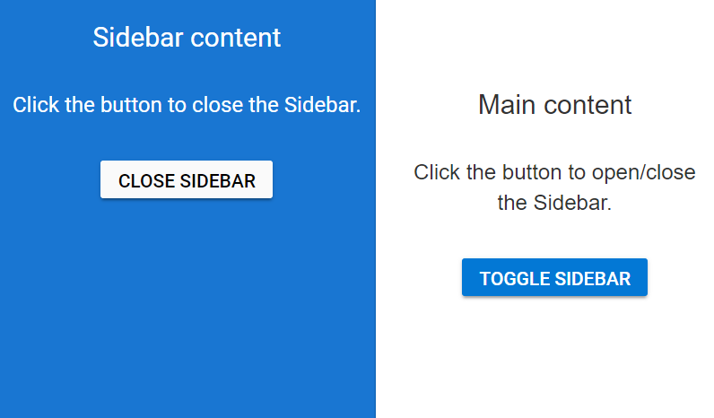

# Open and close the Sidebar

Opening and closing the Sidebar can be achieved with built-in public methods.

| Method | Description  |
|------|------|
| `show()`  |  Method to open the Sidebar. |
| `hide()`  |  Method to close the Sidebar. |
| `toggle()`  |  Method to toggle the open/close state of the Sidebar. |

In the following sample, toggle method has been used to show or hide the Sidebar on button click.





Output be like the below.

