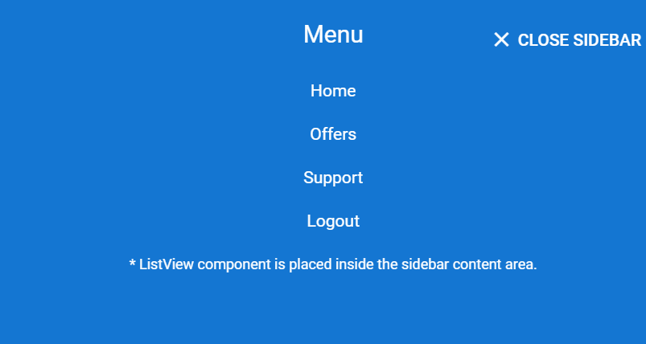

# Initialize the Sidebar with ListView

Any HTML element can be placed in the Sidebar content area. Sidebar supports all types of HTML structures like `TreeView`, `ListView`, etc.

In the following example, the Sidebar is rendered with ListView component in its content area.

* Add the HTML div tag with its id attribute as `default` in your `index.html` file to initialize the Sidebar.





Output be like the below in Expanded state, the sidebar width is set as 100%.

In Collapsed state, the output be like the below.

