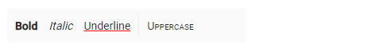

# Set command customization

The `htmlAttributes` property of the Toolbar item is used to set the HTML attributes ('ID', 'class', 'style' ,'role') for the commands.

When style attributes are added, if the same attributes were already present, they will be replaced. This is not so in the case of `class` attribute. Classes will be added to the element instead of replacing the existing ones.

Single or multiple CSS classes can be added to the Toolbar commands using the Toolbar item `cssClass` property.





Output be like the below.

