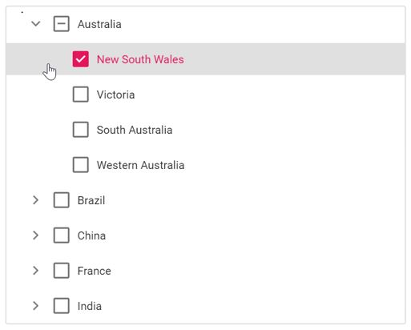

# Check/uncheck the checkbox on clicking the tree node text

You can check and uncheck the checkboxes of tree view by clicking the tree node using the `nodeClicked` event of TreeView.





Output be like the below.

