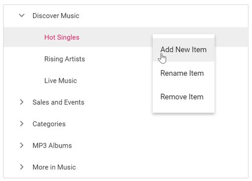

# Process the tree node operations using context menu

You can integrate the context menu with 'TreeView' control in order to perform the tree view related operations like add, remove and renaming node.

Following is an example which demonstrates the above cases which are used to manipulate tree view operations in the 'select ' event of context menu.





Output be like the below.

