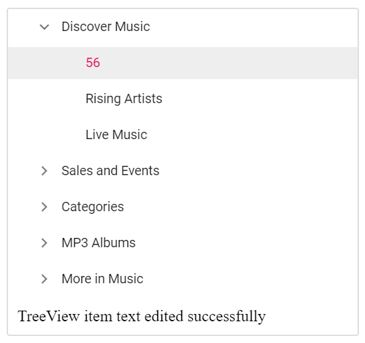

# Validate the text when renaming the tree node

You can validate the tree node text while editing using `nodeEdited` event of the TreeView. Following is an example that shows how to validate and prevent empty values in tree node.





Output be like the below.

