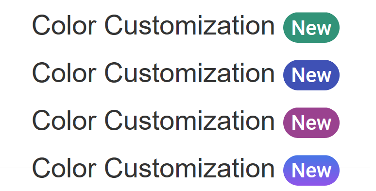
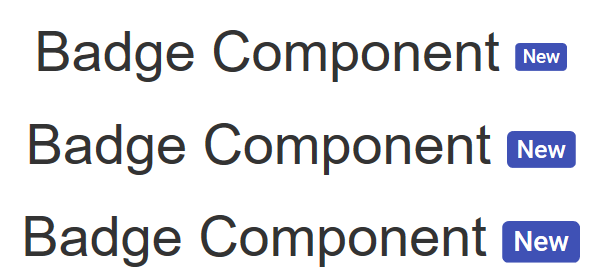

# Badge Customization

## Colour customization

Even though badges come with `8 predefined colors`, you can also customize the colour of the badge as desired.





Output be like the below.

## Customize badge size

Badges are designed to change its size based on the content. To change the size of a badge, adjust the `font size` of the badge.





Output be like the below.

## Custom position

Even though the badges support the conventional `top` and `bottom` positions, the position of the badges can be changed as desired.
This can be done by adding a custom class to the badge element to override the default position applied from the source.





Output be like the below.

