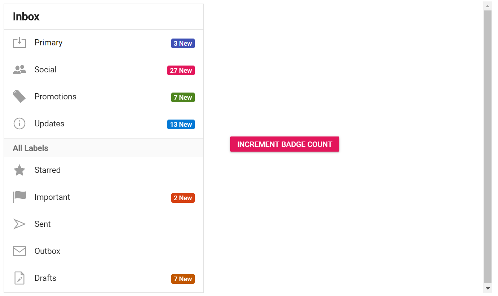

# Dynamic Badge Content

Badges in real-time needs to be updated dynamically based on the requirements. The following sample demonstrates how to
update the badges content dynamically. Click the increment button to change the badge value.





Output be like the below.

