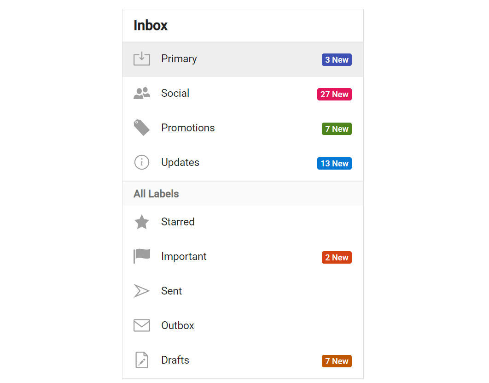

# Integrate Badge into ListView

The badges can be integrated with the `listview` component to indicate new notification with colour based on priority.

In the following sample, `default` badges are used and there is no need to customize the badge size. The component
will automatically adjust the size based on the container element.





Output be like the below.

