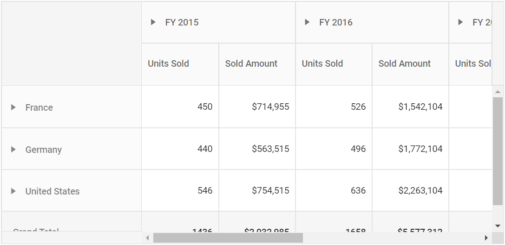
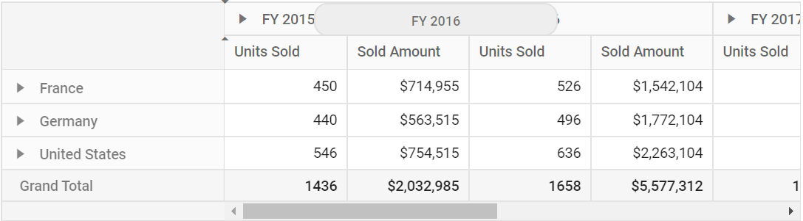
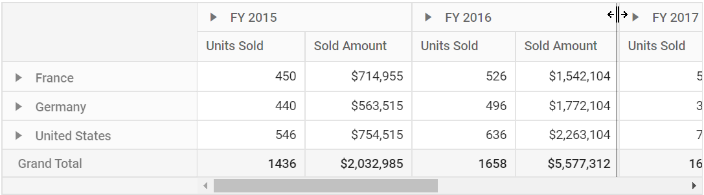
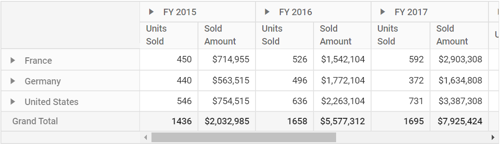

<!-- markdownlint-disable MD012 -->

# Row and Column

## Width and Height

Allows end user to set the pivot table's height and width by using [`Height`](https://help.syncfusion.com/cr/aspnetcore-js2/Syncfusion.EJ2.PivotView.PivotView.html#Syncfusion_EJ2_PivotView_PivotView_Height) and [`Width`](https://help.syncfusion.com/cr/aspnetcore-js2/Syncfusion.EJ2.PivotView.PivotView.html#Syncfusion_EJ2_PivotView_PivotView_Width) properties in [`PivotView`](https://help.syncfusion.com/cr/aspnetmvc-js2/Syncfusion.EJ2.PivotView.PivotView.html) class respectively. The supported formats to set [`Height`](https://help.syncfusion.com/cr/aspnetcore-js2/Syncfusion.EJ2.PivotView.PivotView.html#Syncfusion_EJ2_PivotView_PivotView_Height) and [`Width`](https://help.syncfusion.com/cr/aspnetcore-js2/Syncfusion.EJ2.PivotView.PivotView.html#Syncfusion_EJ2_PivotView_PivotView_Width) properties are,

* Pixel: For example - 100, 200, "100px", "200px".
* Percentage: For example - "100%", "200%".
* Auto: It is applicable for [`Height`](https://help.syncfusion.com/cr/aspnetcore-js2/Syncfusion.EJ2.PivotView.PivotView.html#Syncfusion_EJ2_PivotView_PivotView_Height) property alone in-order to render the pivot table beyond its parent container height without vertical scrollbar. The parent container here would show its vertical scrollbar as soon as the component reaches beyond its dimension.

> The pivot table will not be displayed less than **400px**, since it's the minimum width of the component.





## Row Height

Allows end user to set the height of each pivot table rows commonly using the [`RowHeight`](https://help.syncfusion.com/cr/aspnetcore-js2/Syncfusion.EJ2.PivotView.PivotViewGridSettings.html#Syncfusion_EJ2_PivotView_PivotViewGridSettings_RowHeight) property in [`PivotViewGridSettings`](https://help.syncfusion.com/cr/aspnetmvc-js2/Syncfusion.EJ2.PivotView.PivotViewGridSettings.html) class.

> By default, the [`RowHeight`](https://help.syncfusion.com/cr/aspnetcore-js2/Syncfusion.EJ2.PivotView.PivotViewGridSettings.html#Syncfusion_EJ2_PivotView_PivotViewGridSettings_RowHeight) property is set as **36** pixels for desktop layout and **48** pixels for mobile layout.
> The height of the column headers alone may vary when grouping bar feature is enabled.

In the below code sample, the [`RowHeight`](https://help.syncfusion.com/cr/aspnetcore-js2/Syncfusion.EJ2.PivotView.PivotViewGridSettings.html#Syncfusion_EJ2_PivotView_PivotViewGridSettings_RowHeight) property is set as **60** pixels.





## Column Width

Allows end user to set the width of each pivot table columns commonly using the [`ColumnWidth`](https://help.syncfusion.com/cr/aspnetcore-js2/Syncfusion.EJ2.PivotView.PivotViewGridSettings.html#Syncfusion_EJ2_PivotView_PivotViewGridSettings_ColumnWidth) property in [`PivotViewGridSettings`](https://help.syncfusion.com/cr/aspnetmvc-js2/Syncfusion.EJ2.PivotView.PivotViewGridSettings.html) class.

> By default, the [`ColumnWidth`](https://help.syncfusion.com/cr/aspnetcore-js2/Syncfusion.EJ2.PivotView.PivotViewGridSettings.html#Syncfusion_EJ2_PivotView_PivotViewGridSettings_ColumnWidth) property is set as **110** pixels to each columns except the first column. For first column, **250** pixels and **200** pixels are set respectively with and without grouping bar.

In the below example, the [`ColumnWidth`](https://help.syncfusion.com/cr/aspnetcore-js2/Syncfusion.EJ2.PivotView.PivotViewGridSettings.html#Syncfusion_EJ2_PivotView_PivotViewGridSettings_ColumnWidth) property is set as **200** pixels.





## Reorder

Allows end user to reorder a particular column header from one index to another index within the pivot table through drag-and-drop option. It can be enabled by setting the [`AllowReordering`](https://help.syncfusion.com/cr/aspnetcore-js2/Syncfusion.EJ2.PivotView.PivotViewGridSettings.html#Syncfusion_EJ2_PivotView_PivotViewGridSettings_AllowReordering) property in [`PivotViewGridSettings`](https://help.syncfusion.com/cr/aspnetmvc-js2/Syncfusion.EJ2.PivotView.PivotViewGridSettings.html) class to **true**.





## Column Resizing

Allows end user to resize the columns by clicking and dragging the right edge of the column header. While dragging, the width of the respective column will be resized immediately. To enable column resizing option, set the [`AllowResizing`](https://help.syncfusion.com/cr/aspnetcore-js2/Syncfusion.EJ2.PivotView.PivotViewGridSettings.html#Syncfusion_EJ2_PivotView_PivotViewGridSettings_AllowResizing) property in [`PivotViewGridSettings`](https://help.syncfusion.com/cr/aspnetmvc-js2/Syncfusion.EJ2.PivotView.PivotViewGridSettings.html) class to **true**.

> By default, the column resizing option is enabled.
> In RTL mode, user can click and drag the left edge of the header cell to resize the column.





## Text Wrap

Allows end user to wrap the cell content to the next line when it exceeds the boundary of the cell width. To enable text wrap, set the [`AllowTextWrap`](https://help.syncfusion.com/cr/aspnetcore-js2/Syncfusion.EJ2.PivotView.PivotViewGridSettings.html#Syncfusion_EJ2_PivotView_PivotViewGridSettings_AllowTextWrap) property in [`PivotViewGridSettings`](https://help.syncfusion.com/cr/aspnetmvc-js2/Syncfusion.EJ2.PivotView.PivotViewGridSettings.html) class to **true**.





## Grid Lines

Allows end user to display cell border for each cells using [`GridLines`](https://help.syncfusion.com/cr/aspnetcore-js2/Syncfusion.EJ2.PivotView.PivotViewGridSettings.html#Syncfusion_EJ2_PivotView_PivotViewGridSettings_GridLines) property in [`PivotViewGridSettings`](https://help.syncfusion.com/cr/aspnetmvc-js2/Syncfusion.EJ2.PivotView.PivotViewGridSettings.html) class.

Available mode of grid lines are:

| Modes | Actions |
|-------|---------|
| Both | Displays both the horizontal and vertical grid lines.|
| None | No grid lines are displayed.|
| Horizontal | Displays the horizontal grid lines only.|
| Vertical | Displays the vertical grid lines only.|
| Default | Displays grid lines based on the theme.|

> By default, pivot table renders grid lines in **Both** mode.





## Selection

Selection provides an option to highlight a row or a column or a cell. It can be done through simple mouse down or arrow keys. To enable selection in the pivot table, set the [`AllowSelection`](https://help.syncfusion.com/cr/aspnetcore-js2/Syncfusion.EJ2.PivotView.PivotViewGridSettings.html#Syncfusion_EJ2_PivotView_PivotViewGridSettings_AllowSelection) property in [`PivotViewGridSettings`](https://help.syncfusion.com/cr/aspnetmvc-js2/Syncfusion.EJ2.PivotView.PivotViewGridSettings.html) class to **true**.

The pivot table supports two types of selection that can be set using [`Type`](https://help.syncfusion.com/cr/aspnetcore-js2/Syncfusion.EJ2.PivotView.PivotViewPivotSelectionSettings.html#Syncfusion_EJ2_PivotView_PivotViewPivotSelectionSettings_Type) property in [`PivotViewSelectionSettings`](https://help.syncfusion.com/cr/aspnetmvc-js2/Syncfusion.EJ2.PivotView.PivotViewPivotSelectionSettings.html) class. The selection types are:

* `Single`: It is set by default, and it only allows selection of a single row or a column or a cell.
* `Multiple`: Allows you to select multiple rows or columns or cells.
To perform multi-selection, press and hold "CTRL" key and click the desired rows or cells. To select range of rows or cells, press and hold the "SHIFT" key and click the rows or columns or cells.





### Selection Mode

The pivot table supports four types of selection mode that can be set using [`Mode`](https://help.syncfusion.com/cr/aspnetcore-js2/Syncfusion.EJ2.PivotView.PivotViewPivotSelectionSettings.html#Syncfusion_EJ2_PivotView_PivotViewPivotSelectionSettings_Mode) property in [`PivotViewSelectionSettings`](https://help.syncfusion.com/cr/aspnetmvc-js2/Syncfusion.EJ2.PivotView.PivotViewPivotSelectionSettings.html) class.. The selection modes are:

* [**SelectionMode.Row**](https://help.syncfusion.com/cr/aspnetmvc-js2/Syncfusion.EJ2.PivotView.SelectionMode.html): It is set by default, and allows user to select only rows.
* [**SelectionMode.Column**](https://help.syncfusion.com/cr/aspnetmvc-js2/Syncfusion.EJ2.PivotView.SelectionMode.html): Allows user to select only columns.
* [**SelectionMode.Cell**](https://help.syncfusion.com/cr/aspnetmvc-js2/Syncfusion.EJ2.PivotView.SelectionMode.html): Allows user to select only cells.
* [**SelectionMode.Both**](https://help.syncfusion.com/cr/aspnetmvc-js2/Syncfusion.EJ2.PivotView.SelectionMode.html): Allows user to select rows and columns at the same time.





### Cell Selection Mode

The pivot table supports two types of cell selection mode that can be set using [`CellSelectionMode`](https://help.syncfusion.com/cr/aspnetcore-js2/Syncfusion.EJ2.PivotView.PivotViewPivotSelectionSettings.html#Syncfusion_EJ2_PivotView_PivotViewPivotSelectionSettings_CellSelectionMode) in [`PivotViewSelectionSettings`](https://help.syncfusion.com/cr/aspnetmvc-js2/Syncfusion.EJ2.PivotView.PivotViewPivotSelectionSettings.html) class. The cell selection modes are:

* [**PivotCellSelectionMode.Flow**](https://help.syncfusion.com/cr/aspnetmvc-js2/Syncfusion.EJ2.PivotView.PivotCellSelectionMode.html): It is set by default. The range of cells are selected between the start index and end index that includes in-between cells of rows.
* [**PivotCellSelectionMode.Box**](https://help.syncfusion.com/cr/aspnetmvc-js2/Syncfusion.EJ2.PivotView.PivotCellSelectionMode.html): Range of cells are selected from the start and end column indexes that includes in-between cells of rows within the range.





> Cell selection requires [`Mode`](https://help.syncfusion.com/cr/aspnetcore-js2/Syncfusion.EJ2.PivotView.PivotViewPivotSelectionSettings.html#Syncfusion_EJ2_PivotView_PivotViewPivotSelectionSettings_Mode) property in [`PivotViewSelectionSettings`](https://help.syncfusion.com/cr/aspnetmvc-js2/Syncfusion.EJ2.PivotView.PivotViewPivotSelectionSettings.html) class to be [**SelectionMode.Cell**](https://help.syncfusion.com/cr/aspnetmvc-js2/Syncfusion.EJ2.PivotView.SelectionMode.html) or [**SelectionMode.Both**](https://help.syncfusion.com/cr/aspnetmvc-js2/Syncfusion.EJ2.PivotView.SelectionMode.html), and [`Type`](https://help.syncfusion.com/cr/aspnetcore-js2/Syncfusion.EJ2.PivotView.PivotViewPivotSelectionSettings.html#Syncfusion_EJ2_PivotView_PivotViewPivotSelectionSettings_Type) property should be `Multiple`.

## Clip Mode

The clip mode provides options to display its overflow cell content in the pivot table. It can be configured using the [`ClipMode`](https://help.syncfusion.com/cr/aspnetcore-js2/Syncfusion.EJ2.PivotView.PivotViewGridSettings.html#Syncfusion_EJ2_PivotView_PivotViewGridSettings_ClipMode) property in [`PivotViewGridSettings`](https://help.syncfusion.com/cr/aspnetmvc-js2/Syncfusion.EJ2.PivotView.PivotViewGridSettings.html) class. The pivot table supports three types of clip modes which are:

* `Clip`: Truncates the cell content when it overflows its area.
* `Ellipsis`: Displays ellipsis when the cell content overflows its area.
* `EllipsisWithTooltip`: Displays ellipsis when the cell content overflows its area, also it will display the tooltip while hover on ellipsis is applied.

>By default, [`ClipMode`](https://help.syncfusion.com/cr/aspnetcore-js2/Syncfusion.EJ2.PivotView.PivotViewGridSettings.html#Syncfusion_EJ2_PivotView_PivotViewGridSettings_ClipMode) value is set to `Ellipsis`.





## Cell Template

You can customize the pivot table cell element by using the `CellTemplate` property in `PivotViewTemplates` class. The `CellTemplate` property accepts either an HTML string or the element's ID, which can be used to append additional HTML elements to showcase each cell with custom format.

In this demo, the revenue cost for each year is represented with trend icons.

>We need to specify the model type for datasource from which the context will be generated and accessed in the CellTemplate. Using the context we can define the conditions based on that templates will be appended to the cell element





## See Also

* [Show/hide tooltip](./how-to/show-hide-tool-tip)
* [Perform cell selection and get selected cells information](./how-to/perform-cell-selection-and-get-selected-cells-information)