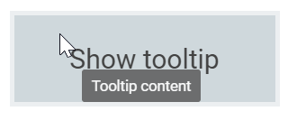

# Tooltip Positioning

Tooltips can be attached to 12 static locations around the target.
On initializing the Tooltip, you can set the position property with any one of the following values:

* `TopLeft`
* `TopCenter`
* `TopRight`
* `BottomLeft`
* `BottomCenter`
* `BottomRight`
* `LeftTop`
* `LeftCenter`
* `LeftBottom`
* `RightTop`
* `RightCenter`
* `RightBottom`

> By default, Tooltip is placed at the `TopCenter` of the target element.





Output be like the below.

## Tip pointer positioning

The Tooltip pointer can be attached or detached from the Tooltip by using the `showTipPointer` property.
Pointer positions can be adjusted using the `tipPointerPosition` property that can be assigned to one of the following values:

* `auto`
* `start`
* `middle`
* `end`

The following code example illustrates how to set the pointer to the start position of the Tooltip.





Output be like the below.

By default, tip pointers are auto adjusted so that the arrow does not point outside the target element.

## Dynamic positioning

The Tooltip and its tip pointer can be positioned dynamically based on the target's location. This can be achieved by using the `refresh`
 method, which auto adjusts the Tooltip over the target.





> When mouse trailing option is enabled, the tip pointer position gets auto adjusted based on the target, and
> other position values like start, end, and middle are not applied (to prevent the pointer from moving out of target).

Output be like the below.

## Mouse Trailing

Tooltips can be positioned relative to the mouse pointer. This behavior can be enabled or disabled by using the `mouseTrail` property. By default, it is set to `false`.





Output be like the below.

> When mouse trailing option is enabled, the tip pointer position gets auto adjusted based on the target, and other position values like start, end, and middle are not applied (to prevent the pointer from moving out of target).

## Setting offset values

Offset values are set to specify the distance between the target and tooltip element.
`offsetX` and `offsetY` properties are used to specify the offset left and top values.

* `offsetX` specifies the distance between the target and Tooltip element in X axis.
* `offsetY` specifies the distance between the target and Tooltip element in Y axis.

The following code example illustrates how to set offset values.





Output be like the below.

> By default, collision is handled automatically and therefore when collision is detected the Tooltip fits horizontally and flips vertically.
