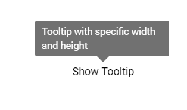

# Setting Dimension

## Height and width

The Tooltip can either be assigned auto height and width values or specific pixel values. The `width` and `height` properties are used to
 set the outer dimension of the Tooltip element. The default value for both the properties is `auto`.
  It also accepts string and number values in pixels.

The following sample explains how to set dimensions for the Tooltip.





Output be like the below.

### Scroll mode

When `height` is specified with a certain pixel value and the Tooltip content overflows, the scrolling mode gets enabled.





Output be like the below.

> The scrolling mode can best be seen when the sticky mode of the Tooltip is enabled. To enable sticky mode, set the `isSticky` property to true.
