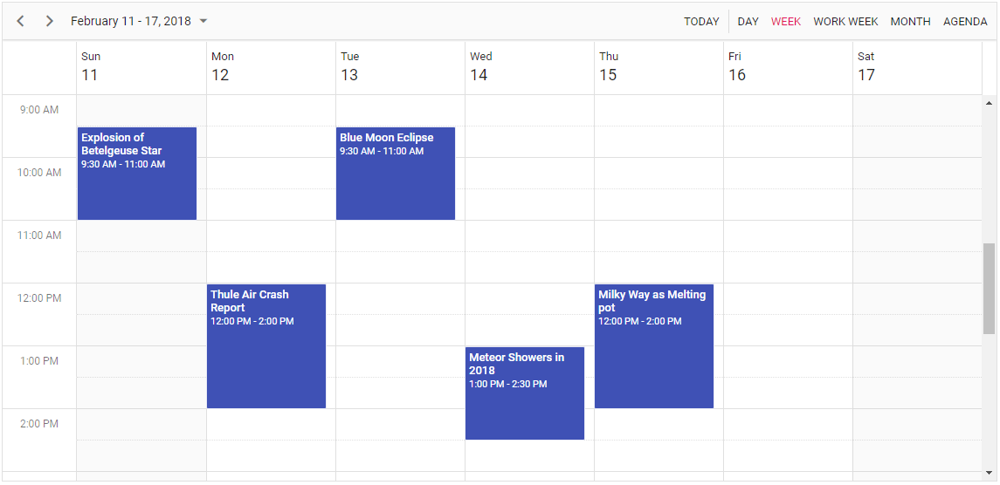

# Getting Started

This section briefly explains about how to include a simple [ASP.NET MVC Scheduler](https://www.syncfusion.com/aspnet-mvc-ui-controls/scheduler) in your ASP.NET MVC application. You can refer the [ASP.NET MVC Getting Started documentation](../getting-started) page for introduction part of the system requirements and common component configurations.

## Initialize the Scheduler component

We are going to render `Scheduler` component in ASP.NET MVC application. Add the below simple code to your `index.cshtml` page which is available within the `Views/Home` folder, to initialize the Scheduler.





> Running the above code will display an empty Scheduler with system date and time on the browser like below.


## Populating appointments

To populate an empty Scheduler with appointments, bind the event data to it by
assigning the `DataSource` property under `EventSettings` property.

* Create a new Class in controller page to define the data to be passed to the Scheduler as mentioned below,

```c#
public class AppointmentData
{
    public int Id { get; set; }
    public string Subject { get; set; }
    public DateTime StartTime { get; set; }
    public DateTime EndTime { get; set; }
}
```

* Now create an instance of the class and add the list of Scheduler data to it within the Index method in controller page, which will then be passed to the View page and bound to the Scheduler dataSource.

* Call the GetScheduleData method to assign the datasource in Index method as shown below,

```c#
public ActionResult Index()
{
    ViewBag.appointments = GetScheduleData();
    return View();
}

public List<AppointmentData> GetScheduleData()
{
    List<AppointmentData> appData = new List<AppointmentData>();
    appData.Add(new AppointmentData
    {
        Id = 1,
        Subject = "Explosion of Betelgeuse Star",
        StartTime = new DateTime(2018, 2, 11, 9, 30, 0),
        EndTime = new DateTime(2018, 2, 11, 11, 0, 0)
    });
    appData.Add(new AppointmentData
    {
        Id = 2,
        Subject = "Thule Air Crash Report",
        StartTime = new DateTime(2018, 2, 12, 12, 0, 0),
        EndTime = new DateTime(2018, 2, 12, 14, 0, 0)
    });
    appData.Add(new AppointmentData
    {
        Id = 3,
        Subject = "Blue Moon Eclipse",
        StartTime = new DateTime(2018, 2, 13, 9, 30, 0),
        EndTime = new DateTime(2018, 2, 13, 11, 0, 0)
    });
    appData.Add(new AppointmentData
    {
        Id = 4,
        Subject = "Meteor Showers in 2018",
        StartTime = new DateTime(2018, 2, 14, 13, 0, 0),
        EndTime = new DateTime(2018, 2, 14, 14, 30, 0)
    });
    appData.Add(new AppointmentData
    {
        Id = 5,
        Subject = "Milky Way as Melting pot",
        StartTime = new DateTime(2018, 2, 15, 12, 0, 0),
        EndTime = new DateTime(2018, 2, 15, 14, 0, 0)
    });
    return appData;
}
```

* Add the Scheduler code in View page as shown below,

```c#
@using Syncfusion.EJ2.Schedule

@(Html.EJS().Schedule("schedule")
    .Height("550px")
    .EventSettings(new ScheduleEventSettings { DataSource = ViewBag.appointments })
    .SelectedDate(new DateTime(2018, 2, 15))
    .Render()
)
```





Output be like the below.



## Setting  date

Scheduler usually displays the system date as its current date. To change the current date of scheduler with specific date, define the `selectedDate` property.





## Setting view

Scheduler displays `week` view by default. To change the current view, define the applicable view name to the `currentView` property. The applicable view names are,

* Day
* Week
* WorkWeek
* Month
* Year
* Agenda
* MonthAgenda
* TimelineDay
* TimelineWeek
* TimelineWorkWeek
* TimelineMonth
* TimelineYear





## Individual view customization

Each individual scheduler views can be customized with its own options such as setting different start and end hour on Week and Work Week views, whereas hiding the weekend days on Month view alone.
This can be achieved by defining views property to accept the array of object type, where each object depicts the individual view customization.





> You can also explore our [ASP.NET MVC Scheduler example](https://ej2.syncfusion.com/aspnetmvc/Schedule/Overview#/material) that shows how to use the toolbar buttons to play with Scheduler functionalities.
